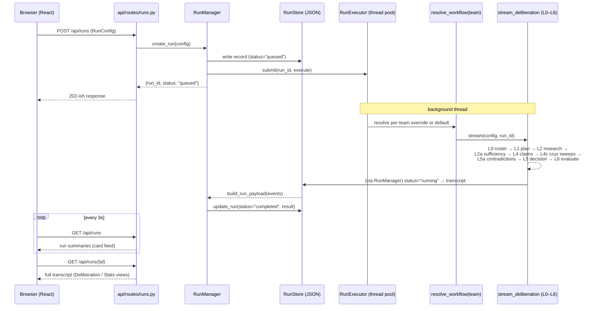
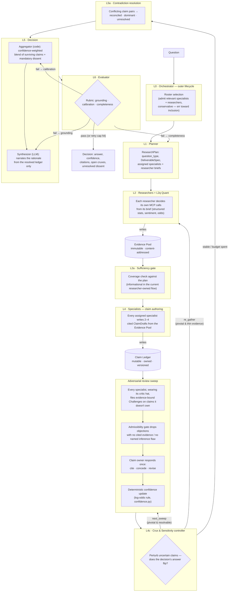
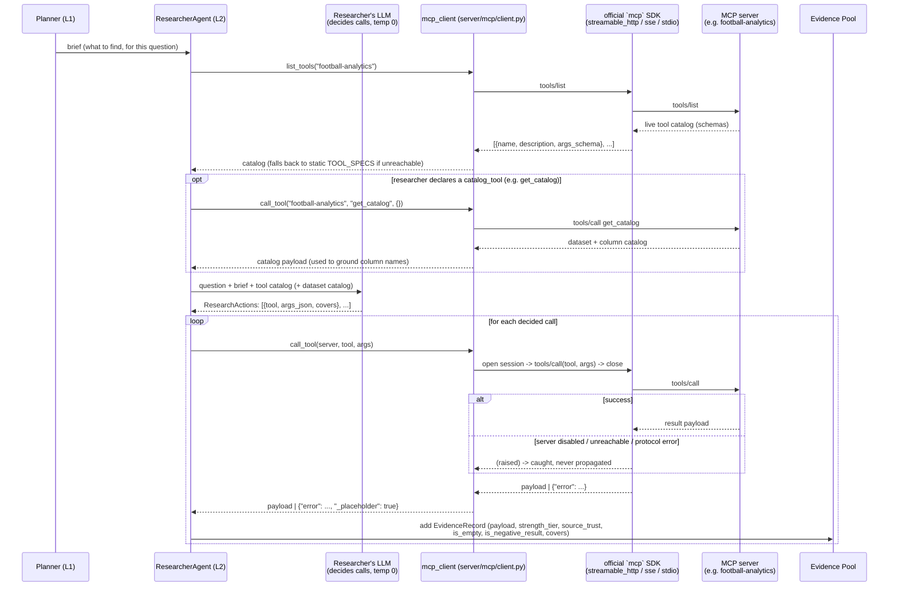

# Agent Council

This is an early iteration of an agentic council POC. Later iterations remain private.

An **evidence-grounded multi-agent deliberation platform**. You give it a
prompt; a roster of specialist agents research it against real data sources
(via MCP), write typed, cited claims, challenge each other's claims with
evidence-backed objections, and a deterministic decision layer aggregates the
surviving, confidence-weighted claims into a calibrated answer — with any
unresolved disagreement carried through, never hidden. The whole run is
persisted, traced in Langfuse, and rendered live in a web UI.

The engine is **config-driven** and **workflow-agnostic**: a single
`RunConfig` object (built by the UI wizard) describes everything about a run,
and teams are plain folders on disk — adding a new team, agent, researcher, or
data source is additive, no core changes required.

> This is the "v3" epistemic pipeline: rounds of prose debate scored by a
> single judge have been replaced by two typed stores — an immutable
> **Evidence Pool** and a versioned, owned **Claim Ledger** — and a layered
> L0→L6 pipeline that reasons over them. See [The deliberation
> pipeline](#the-deliberation-pipeline) for why and how.

---

## Table of contents

- [How it works](#how-it-works)
- [Tech stack](#tech-stack)
- [Running locally](#running-locally)
- [Repository layout](#repository-layout)
- [Architecture & request flow](#architecture--request-flow)
- [The deliberation pipeline](#the-deliberation-pipeline)
- [Evidence Pool & Claim Ledger](#evidence-pool--claim-ledger)
- [MCP integration & tool catalog](#mcp-integration--tool-catalog)
- [Configuration (`RunConfig`)](#configuration-runconfig)
- [Extending the platform](#extending-the-platform)
- [API reference](#api-reference)
- [Frontend views](#frontend-views)

---

## How it works

1. In the UI you write a prompt, pick a **team**, choose which **specialists**
   participate (or let the **planner** decide via smart routing), and set the
   model(s) and deliberation bounds.
2. The wizard serializes this into a `RunConfig` and `POST`s it to the
   backend.
3. The backend runs the pipeline **asynchronously** on a background thread
   pool and persists the result. The frontend **polls** every 3s for status.
4. When a run completes, its card unlocks the **Deliberation** view (roster,
   plan, evidence retrieved, claims, challenge sweeps, contradictions, the
   final decision) and the **Stats** view (confidence, coverage, drill down
   into any claim's argument thread or the raw evidence behind it). You can
   then open a **Follow-up** chat to interrogate the result.

Specialists don't call tools directly — a dedicated **researcher team** does
all retrieval, against real data reached through **MCP servers**: the example
football team pulls structured statistics from a Postgres-backed analytics
warehouse (fan-sentiment and odds researchers exist but their servers aren't
stood up yet — until they are, those calls resolve as clean, recorded gaps
rather than failures).

---

## Tech stack

| Layer          | Technology                                                              |
| -------------- | ------------------------------------------------------------------------ |
| Backend        | Python 3.14, FastAPI, uvicorn                                            |
| Agents         | LangChain + LangGraph (ReAct researchers), OpenAI (`gpt-4o-mini` default)|
| Tool access    | MCP (official `mcp` SDK) — streamable-http / SSE / stdio servers         |
| Observability  | Langfuse (traces, prompt management, cost/budget)                        |
| Persistence    | JSON files on disk (swappable `RunStore`)                                |
| Frontend       | React 19, Vite, TypeScript, TailwindCSS v4, Radix UI, Recharts           |
| Deploy         | Docker (`.ci/`), Kubernetes manifests (`.k8s/`), CloudNativePG            |

The underlying data sources (Postgres, Qdrant, whatever a given MCP server
wraps) are **external resources** — the platform connects to them but does
not manage them.

---

## Running locally

There are two ways to run the stack: with **Docker Compose** (recommended —
one command) or **natively** with `uv` and `npm`.

### Configure environment

Create a `.env` file in the repository root:

```
OPENAI_API_KEY=sk-...

# PostgreSQL (backs the football-analytics MCP server, run separately)
DB_HOST=127.0.0.1
DB_PORT=5432
DB_DATABASE=garviznormalize
DB_USER=garviz_user
DB_PASSWORD=SuperSecret123

# Qdrant (fan-channel transcript embeddings, when the sentiment server is live)
QDRANT_URL=http://localhost:6333
EMBEDDING_MODEL=text-embedding-3-small
QDRANT_DEFAULT_COLLECTION=yt_transcripts

# Langfuse (tracing + prompt management). Opt-in: leave blank and the
# pipeline runs untraced with local-file prompt fallback.
LANGFUSE_PUBLIC_KEY=
LANGFUSE_SECRET_KEY=
LANGFUSE_BASE_URL=http://localhost:3000

# MCP servers (server/mcp/servers.toml holds the defaults). Convention:
# MCP_<NAME>_URL / _TRANSPORT / _TOKEN / _ENABLED / _HEADERS, <NAME> upper-snaked.
# MCP_FOOTBALL_ANALYTICS_URL=http://localhost:3001/mcp
```

> `DB_HOST` / `QDRANT_URL` / MCP `*_URL` are written from the host's point of
> view. Under Docker Compose the server container can't reach `localhost`, so
> the compose file rewrites those to `host.docker.internal` (and sends a
> `Host: localhost:3001` header to the MCP server, whose DNS-rebinding guard
> only trusts a localhost `Host`) — no `.env` edit needed.

### Option A — Docker Compose (recommended)

**Prerequisites:** Docker Desktop (or Docker Engine + Compose v2), your
external Postgres/Qdrant, and the `football-analytics` MCP server, all
running on the host.

```bash
docker compose up --build
```

| Service  | URL                   | Notes                                  |
| -------- | --------------------- | --------------------------------------- |
| `client` | http://localhost:5173 | Vite dev server with hot-module reload  |
| `server` | http://localhost:8080 | FastAPI via `uvicorn --reload`          |

Both `./server` and `./client` are bind-mounted, so source edits reload live.
Stop with `Ctrl-C`, or `docker compose down` to remove the containers. The dev
images live in `.ci/Dockerfile.{server,client}.dev`.

### Option B — Run natively

**Prerequisites:** Python 3.14+ and [uv](https://docs.astral.sh/uv/),
Node.js 20+ and npm, plus the external services above.

```bash
# Terminal 1 — server (http://localhost:8080)
uv sync
uv run python -m server.api.app

# Terminal 2 — client (http://localhost:5173)
cd client
npm install
npm run dev
```

Vite proxies `/api/*` to the backend (see `client/vite.config.ts`). Open
http://localhost:5173 in your browser.

---

## Repository layout

```
agent-framework/
├── server/
│   ├── api/                          # Thin HTTP layer
│   │   ├── app.py                    #   App factory + entrypoint (uvicorn :8080)
│   │   └── routes/                   #   runs, teams, follow_up routers
│   ├── core/                         # Workflow-agnostic engine (no team specifics)
│   │   ├── config/                   #   RunConfig schema (schema.py)
│   │   ├── agents/
│   │   │   ├── base.py               #     ClaimWriterAgent / SimpleAgent / build_agent()
│   │   │   ├── teams.py              #     specialist_teams discovery from disk
│   │   │   ├── general/              #     planner, synthesizer (cross-team, L1/L5)
│   │   │   └── researchers/          #     researcher catalog (L2, cross-team)
│   │   ├── evidence/                 #   The two stores + their math
│   │   │   ├── models.py             #     EvidenceRecord, Claim, Challenge, Decision, ...
│   │   │   ├── evidence_pool.py      #     L3 store 1 — immutable, content-addressed
│   │   │   ├── claim_ledger.py       #     L3 store 2 — mutable, owner-only, versioned
│   │   │   ├── confidence.py         #     deterministic log-odds confidence rule
│   │   │   └── store.py              #     EvidenceContext (bundles the two, per run)
│   │   ├── orchestration/            #   L0–L6 pipeline (see below) + run lifecycle
│   │   └── persistence/              #   RunStore protocol + JSON-file store
│   ├── mcp/                          # MCP client + per-server config
│   │   ├── client.py                 #   sync Adapter over the official mcp SDK
│   │   ├── config.py                 #   MCPServerConfig, env-var overrides
│   │   └── servers.toml              #   server registry (transport/url/enabled)
│   ├── specialist_teams/             # Per-team isolation (the "what", not the "how")
│   │   └── <team_id>/
│   │       ├── team.json             #   Display name + agent descriptions
│   │       ├── agents/<key>/         #   definition.py (factory) + prompt.md
│   │       └── workflow.py           #   (optional) override the default pipeline
│   ├── run_info/                     # Persisted run records, follow-up threads, analysis history
│   └── main.py, follow_up.py         # CLI demo; follow_up.py = follow-up chat engine
├── client/                           # Vite/React frontend
│   └── src/
│       ├── App.tsx                   #   View switcher (feed / deliberation / stats / chat)
│       ├── components/               #   RunFeed, DeliberationView, StatsView,
│       │                             #   StatsDashboard, StatsDrilldown, Arena, ...
│       ├── hooks/useRunFeed.ts       #   3s polling hook
│       ├── lib/api.ts                #   Typed fetch wrappers
│       └── types/                    #   Shared TypeScript types
├── .ci/                              # Dev + prod Dockerfiles, nginx config
├── docker-compose.yml                # Local dev stack (client + server)
└── .k8s/                             # Kubernetes manifests (CloudNativePG database, app)
```

### The two halves of the backend

The backend is deliberately split so that **generic engine** and
**team-specific content** never bleed into each other:

- **`server/core/`** knows *how* to run a deliberation but nothing about
  football or markets — roster selection, planning, the evidence stores, the
  crux/contradiction/decision/evaluator math, persistence.
- **`server/specialist_teams/<team>/`** knows *what* a team is — its
  specialist agents, their prompts, their claim dimension, and (optionally) a
  custom workflow. Pure content + configuration.

Cutting across both is **`server/core/agents/researchers/`** — a small,
fixed, cross-team catalog (not discovered per-team, like the planner and
synthesizer) that owns all retrieval through MCP.

---

## Architecture & request flow



Step by step:

1. **`RunConfig` arrives** at `POST /api/runs`. Pydantic validates it (bad
   configs → `422`; unknown team → `400`).
2. **`RunManager.create_run`** mints a run id, writes a `queued` record to the
   `RunStore`, and submits the work to the **`RunExecutor`** (a bounded
   `ThreadPoolExecutor`). It returns immediately.
3. **In the background**, `RunManager._execute` flips the record to
   `running`, then calls **`resolve_workflow(team_id)`** — a per-team
   `workflow.py` override if present, otherwise the default
   **`DeliberationWorkflow`**, which drives `stream_deliberation`.
4. `stream_deliberation` runs the full **L0→L6 pipeline** (below), yielding a
   stream of typed events (`roster`, `routing`, `plan`, `retrieval`,
   `sufficiency`, `claim`, `sweep`, `crux`, `contradictions`, `evaluation`,
   `decision`, `verdict`, `evidence_snapshot`).
5. **`build_run_payload`** reduces those events into the final transcript
   shape and the record is updated to `completed` (or `failed`, with the
   error).
6. The frontend **polls `GET /api/runs`** (the `useRunFeed` hook) for the
   card feed and fetches `GET /api/runs/{id}` for the full transcript once
   done.

**Two swap seams** keep this open for scale without touching orchestration:

- **`RunExecutor`** — swap the in-process thread pool for a durable queue
  (Celery/ARQ/Redis) by implementing one method.
- **`RunStore`** — swap JSON files for Postgres/Redis by implementing the
  abstract store.

Every run is also wrapped in a single **Langfuse trace** (`observability.py`,
opt-in via `.env`), so every planner/researcher/specialist/synthesizer call —
prompts, tool calls, retrieved payloads, cost — nests under one span,
including the follow-up chat threads.

---

## The deliberation pipeline

The old design was a LangGraph state machine: agents debated in rounds, a
single judge scored each round on weighted categories, and a threshold
decided when consensus was "reached." That's gone. The new pipeline is an
explicit, ordered **L0→L6 driver** (`core/orchestration/pipeline.py`) — no
graph framework: each layer is a real module, the bounded loops are plain
`for`/`while` loops with hard caps, and every layer reads/writes one shared
per-run `EvidenceContext` (see [next section](#evidence-pool--claim-ledger)).



Two control owners, deliberately separate:

- **The Crux (L4c)** is the *inner-loop* controller — *"is deliberation
  done?"* It runs a sensitivity analysis after every sweep: perturb each
  uncertain claim's confidence across its plausible range and check whether
  the decision's argmax answer flips. A claim that *can* flip the answer is a
  **crux**. Three exits per pass: `next_sweep`, `re_gather`, or `stable`. This
  replaces "keep debating until scores cross a threshold" with a principled
  stop: *stop when no admitted objection could change the answer.*
- **The Orchestrator (L0)** is the *outer-lifecycle* controller — *"is the
  whole run acceptable?"* It owns roster selection, the global token/cost
  budget (read from Langfuse), the single planner re-entry counter shared by
  re-gather and the Evaluator's completeness retry, and the failure-routed
  retry loop.

Determinism is scoped to the **math spine**: the only low-variance steps are
the temperature-0 LLM calls (planner sketch, specialists as authors/critics/
owners, synthesizer); everything between them — coverage, confidence,
sensitivity, contradiction ranking, aggregation, the rubric — is plain code.

**Cross-team agents** (shared infrastructure, not per-team content):

| Agent(s)                          | Layer | Role                                                              |
| ---------------------------------- | ----- | ------------------------------------------------------------------ |
| `core/agents/general/planner`      | L1    | Builds the `ResearchPlan` (question type, deliverable shape, roster briefs) |
| `core/agents/researchers/*`        | L2    | Fixed catalog (`simple_stats`, `sentiment`, `odds`) — each owns its MCP calls |
| `core/agents/general/synthesizer`  | L5    | Narrates the final answer from the resolved Claim Ledger only     |

---

## Evidence Pool & Claim Ledger

Instead of paraphrasing arguments across debate rounds, state flows through
two typed stores bundled per-run in an `EvidenceContext`
(`core/evidence/store.py`):

- **Evidence Pool** (`evidence_pool.py`) — immutable, append-only,
  content-addressed. Every MCP tool result or quant estimate lands here
  exactly once (keyed by a hash of tool + args + `as_of`), tagged with a
  **strength tier** (`weak` → `moderate` → `strong` → `authoritative`) and a
  **source trust** multiplier. Claims cite these by id; nothing downstream
  re-fetches what's already here or mutates it.
- **Claim Ledger** (`claim_ledger.py`) — mutable, owner-only, versioned.
  Holds three record types: `Claim` (a single owned, cited, falsifiable
  assertion whose `confidence` is *always* recomputed by the deterministic
  log-odds rule in `confidence.py`, never set by an LLM), `Challenge` (an
  evidence-bound objection any specialist can file against a claim it
  doesn't own), and `Response` (the owner's one answer per admitted
  challenge: cite / concede / revise).

A claim's `confidence_kind` is either `calibratable` (a forecast that
resolves, and can later be Brier/log-loss scored — only for `probability`
questions) or `judgmental` (a recommendation that never resolves; its
confidence is a *defensibility* score, not P(true)).

---

## MCP integration & tool catalog

Specialists never touch a tool — only **researchers** (L2) do, and only
through **MCP** (`server/mcp/`). Everything the application knows about a
data source lives in one config-as-data seam (`server/mcp/config.py` +
`servers.toml`), so promoting a server from a local endpoint to a hardened
production one is an env-var change, never a code change.

### How a researcher call reaches a real endpoint



Key properties of this seam:

- **The researcher decides, the client just dials.** `mcp_client.call_tool`
  (`server/mcp/client.py`) is a thin, synchronous, **never-raising** Adapter
  over the official `mcp` SDK — `call_tool(server, tool, args) -> payload |
  {"error": ...}`. Transport (`streamable_http` / `sse` / `stdio`) is a
  per-server config choice, not something a researcher or the pipeline ever
  sees.
- **Live discovery, static fallback.** Each researcher's tool catalog is
  fetched live via `tools/list` at the start of every `gather()` call; only
  when the server is unreachable does it fall back to the researcher's
  hard-coded `TOOL_SPECS` (kept as a same-shape offline mirror, not the
  source of truth).
- **Failures are gaps, never crashes.** An unregistered/disabled server, a
  bad URL, or a transport error all come back as `{"error": ...}` — the
  researcher writes that as an `is_empty` `EvidenceRecord` (audited, but
  doesn't count toward Sufficiency coverage) instead of the run failing.
  `mcp/payloads.py`'s `is_empty_payload` / `is_negative_result` tell a real
  failure ("couldn't look") apart from a clean negative result ("looked,
  genuinely nothing there" — which *does* resolve a coverage slot).
- **Every call is priced into evidence quality**, not just fetched: each
  researcher fixes a `strength_tier` (weak/moderate/strong/authoritative)
  and a `source_trust` (0–1) for everything it retrieves, so a structured
  warehouse number and a fan-sentiment snippet never carry equal weight
  downstream even if both get cited.

### Tool catalog by researcher

| Researcher | MCP server | Status | Strength tier | Tool | What it does |
| ---------- | ---------- | ------ | -------------- | ---- | ------------- |
| **`simple_stats`**<br/>Simple Stats Researcher | `football-analytics` (`http://localhost:3001/mcp`) | ✅ live | `strong` (source trust 1.0) | `get_catalog` | No-arg discovery: lists available datasets and their columns (`squad_standard_stats`, `squad_shooting`, `squad_playing_time`). Pre-fetched before every decision so calls use confirmed column names. |
| | | | | `query_data` | Query one dataset for rows/aggregates. Single arg `request`: `{dataset, select, filters, aggregations, group_by, order_by, order_direction, limit}`. |
| | | | | `search_entities` | Resolve a free-text player/team name to the entities present in a dataset column: `{dataset, column, search, limit}`. |
| **`sentiment`**<br/>Sentiment Researcher | `sentiment` | ⏸ not stood up (`enabled = false`) — calls resolve as clean gaps until wired | `moderate` (source trust 0.55 — opinion, not measurement) | `search_fan_opinions` | *(placeholder — align with your server)* Semantic search over fan-channel transcripts: `{query, club, top_k}`. |
| | | | | `get_recent_fan_clips` | Most recent fan-channel clips/discussion for a club: `{club, top_k}`. |
| | | | | `list_fan_channels` | Available fan channels to scope a search: `{club}`. |
| **`odds`**<br/>Odds Researcher | `odds` | ⏸ not stood up (`enabled = false`) | `authoritative` (markets price in broad information) | `get_match_odds` | *(placeholder)* Current 1X2 / over-under odds for a fixture: `{team_a, team_b, market}`. |
| | | | | `get_outright_odds` | Outright/futures prices for a competition: `{competition, selection}`. |
| | | | | `get_odds_movement` | How a market's price moved over a recent window: `{team_a, team_b, market, window_days}`. |

The `football-analytics` server itself is an **external** process (its own
Postgres-backed service, run separately — see `docker-compose.yml`'s comment
on `MCP_FOOTBALL_ANALYTICS_URL`); this repo only holds the client-side
config, prompts, and offline tool-spec mirror. `sentiment`'s and `odds`'
`TOOL_SPECS` are explicitly placeholders (`TODO(you)` in their
`definition.py`) — swap them for your real server's schema once it exists;
until then the strings above merely document the intended shape.

### Registering a new server

```toml
# server/mcp/servers.toml
[servers.my-server]
transport = "streamable_http"   # or "sse" / "stdio"
url = "http://localhost:3002/mcp"
enabled = true
```

Override any field per environment without touching the file:

```bash
MCP_MY_SERVER_URL=https://mcp.prod.internal/my-server/mcp
MCP_MY_SERVER_TOKEN=...          # -> Authorization: Bearer ...
MCP_MY_SERVER_HEADERS='{"Host": "localhost:3002"}'   # e.g. Docker's DNS-rebinding workaround
MCP_MY_SERVER_ENABLED=true
```

Then point a researcher's `SERVER` at `"my-server"` (see [Add a
researcher](#extending-the-platform)) — no other code changes.

---

## Configuration (`RunConfig`)

Defined in `server/core/config/schema.py`; this is the single source of truth
for a run.

| Field              | Type                | Meaning                                                                 |
| ------------------- | -------------------- | -------------------------------------------------------------------------- |
| `prompt`            | `str`                | The question to deliberate (required, non-empty).                        |
| `team_id`           | `str`                | Which team debates (must exist under `server/specialist_teams/`).        |
| `smart_routing`     | `bool`               | If true, the L1 planner selects the participating specialists.           |
| `agent_keys`        | `list[str] \| None`  | Explicit specialist subset; `None`/`[]` = all. Ignored under smart routing.|
| `default_model`     | `str`                | Model every specialist/researcher inherits unless overridden.            |
| `agent_models`      | `dict[str, str]`     | Per-specialist model overrides, keyed by agent key.                      |
| `max_passes`        | `int`                | Hard cap on adversarial review sweeps (default 3).                       |
| `per_pass_budget`   | `int`                | Per-sweep challenge budget (kept for config compat; sweeps are actually gated by the admissibility + dedup rules). |

---

## Extending the platform

Everything below is additive — no core edits.

**Add a team.** Create `server/specialist_teams/<team_id>/team.json`:

```json
{
  "name": "My Team",
  "agent_descriptions": { "my_agent": "What this agent specializes in." }
}
```

**Add a specialist.** Create
`server/specialist_teams/<team_id>/agents/<key>/`:

- `prompt.md` — the specialist's persona / domain framing.
- `definition.py` — a factory named `create_<key>_agent` returning a
  `ClaimWriterAgent`:

  ```python
  from pathlib import Path
  from server.core.agents.base import build_claim_writer

  PROMPT_PATH = Path(__file__).parent / "prompt.md"

  def create_my_agent_agent(model_name: str | None = None):
      return build_claim_writer(
          prompt_path=PROMPT_PATH,
          dimension="my_dimension",   # scoring dimension this specialist owns
          key="my_agent",
          label="My Agent",
          model_name=model_name,
      )
  ```

  Teams and specialists are **auto-discovered** at runtime — no registration
  needed. A specialist never calls tools itself; it only reasons over the
  Evidence Pool a researcher already filled.

**Add a researcher.** Add an entry to
`server/core/agents/researchers/registry.py` (a small fixed catalog, unlike
per-team specialists) — each binds a persona, an MCP server label, a
strength tier / source trust, and an offline tool-spec fallback. See
`researchers/simple_stats/definition.py` for the shape.

**Add a data source / tool.** Add a `[servers.<name>]` entry to
`server/mcp/servers.toml` (transport, url, `enabled`), point a researcher at
it via `SERVER = "<name>"`, and override the URL/token per environment with
`MCP_<NAME>_URL` / `MCP_<NAME>_TOKEN` / `MCP_<NAME>_HEADERS`. A disabled or
unreachable server degrades to a recorded evidence gap, never a crash.

**Add a custom workflow.** Drop
`server/specialist_teams/<team_id>/workflow.py` exposing `get_workflow()` or
`WORKFLOW`; `resolve_workflow` will use it instead of the default L0–L6
pipeline.

**Swap the executor / store.** Implement `RunExecutor`
(`core/orchestration/executor.py`) or `RunStore` (`core/persistence/base.py`)
and wire it into the `RunManager` / `get_store()` factory.

---

## API reference

All endpoints are served under `http://localhost:8080`.

| Method   | Path                                                | Purpose                                        |
| -------- | ---------------------------------------------------- | ------------------------------------------------ |
| `GET`    | `/api/teams`                                         | Team catalog (teams → agents + descriptions).    |
| `POST`   | `/api/runs`                                          | Create a run from a `RunConfig`. Returns id.     |
| `GET`    | `/api/runs`                                          | Run summaries, newest first (the 3s poll).       |
| `GET`    | `/api/runs/{id}`                                     | Full run record + transcript.                    |
| `GET`    | `/api/runs/{id}/status`                              | Lightweight status / decided flag.               |
| `DELETE` | `/api/runs/{id}`                                     | Delete a run.                                    |
| `POST`   | `/api/follow-up/{id}/conversations`                  | Start a follow-up conversation on a run.         |
| `GET`    | `/api/follow-up/{id}/conversations`                  | List conversations for a run.                    |
| `GET`    | `/api/follow-up/{id}/conversations/{conv}`           | Fetch one conversation.                          |
| `DELETE` | `/api/follow-up/{id}/conversations/{conv}`           | Delete a conversation.                            |
| `POST`   | `/api/follow-up/{id}/conversations/{conv}/message`   | Ask a question — streamed back over **SSE**.     |

Runs are poll-based; only the follow-up chat streams (Server-Sent Events).
Every follow-up call reuses the same run's evidence + claims and is traced in
Langfuse under the original run's `session_id`.

---

## Frontend views

| View                          | Component                          | Shows                                                                 |
| ------------------------------ | ----------------------------------- | ------------------------------------------------------------------------ |
| Live feed                      | `RunFeed` / `RunCard`               | All runs, polling every 3s; status, decided flag, confidence.           |
| Deliberation                   | `DeliberationView`                  | Roster, plan, retrieval, sweeps, contradictions, final decision — the full transcript. |
| Stats                          | `StatsView` + `StatsDashboard`      | Aggregate confidence / coverage / dissent for a completed run.          |
| Stats drilldown                | `StatsDrilldown`                    | Two modes: **conversation** (a claim threaded with every challenge, response, and revision filed against it, in chat form) and **evidence** (the raw Evidence Pool). |
| Compare                        | `Arena` / `CompareSidebar` / `TranscriptDiff` / `TextDiff` | Side-by-side comparison of two runs or two transcript revisions. |
| Follow-up                      | `FollowUpChat`                      | SSE-streamed Q&A grounded in the run's evidence + claims.               |
